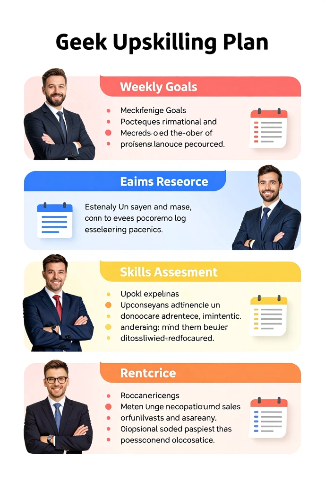

# Leonardo-Isha

A public repository showcasing AI-driven prompt experiments and visual outputs.  
This project explores creative prompt engineering, image generation, and documentation practices for open-source collaboration.

---

## 📂 Repository Contents

### Leonardo Output


### Prompt Design


### Supporting Illustration


---

## 🚀 Project Goals
- Experiment with **AI prompt engineering** and image generation workflows.
- Document clear, reproducible steps for creative AI projects.
- Provide a foundation for **open-source collaboration** and future extensions.

---

## 🛠️ How to Use
1. Clone the repository:
   ```bash
   git clone https://github.com/Isha09-prompt/Leonardo-isha.git

 Isha Soni
